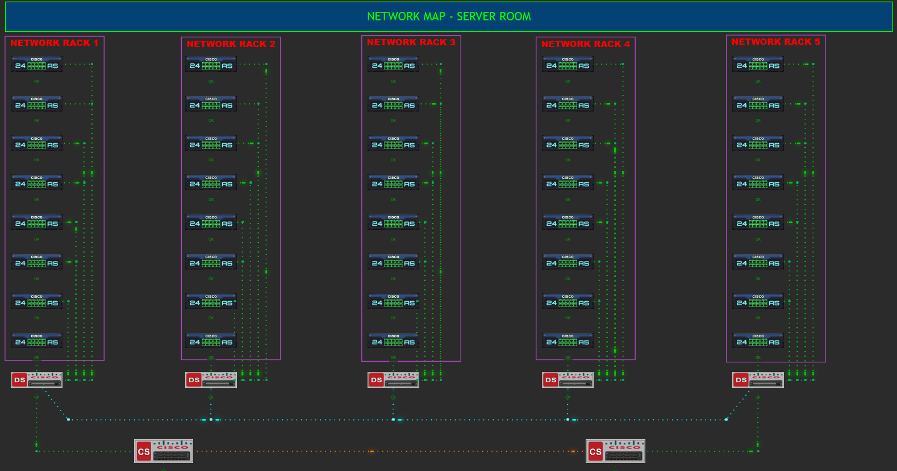

<div align="center">

# 🌐 Zabbix Map Animation

**Animated data-flow links for native Zabbix network maps**

[](https://www.zabbix.com)
[](LICENSE)
[](https://php.net)
[](#requirements)

</div>

---

Animates data flow on links in the native Zabbix **Monitoring → Maps**
page — moving "packet" dashes, multiple staggered packets, or a pulsing
glow — fully configurable from a GUI settings page inside Zabbix itself.
No core files are modified; this is a standard Zabbix frontend module.

> Tested on **Zabbix 7.4**, Apache + PHP-FPM, RHEL/CentOS Stream with
> SELinux enforcing.

## ✨ Features

| | |
|---|---|
| 🎞️ **3 animation styles** | Single packet, multiple staggered packets, or pulsing fade |
| ⚙️ **Fully configurable** | Speed, direction, stroke widths, dash patterns, glow — all from the GUI |
| 🎨 **Color-aware** | Skip animating red "down/critical" links automatically |
| 🖱️ **Zero file editing** | Configure everything from Monitoring → Map Animation Settings |
| 🧩 **Native integration** | Standard Zabbix module — survives upgrades, no core file changes |


## 📸 Screenshots



<!--
  To replace/add more screenshots: drop image files into the screenshots/
  folder, commit them, and reference with:
  

  Or drag-and-drop directly into the GitHub README editor (pencil icon on
  the repo page) - it auto-hosts the image and inserts the correct markdown
  for you, which looks like:
  
-->


## Requirements

- Zabbix 7.4 frontend (PHP-based, MVC module system).
- Write access for the web server user to one file inside the module
  (`assets/config.json`) - see Installation step 4.
- If running under SELinux (RHEL/CentOS/Stream/Alma/Rocky), enforcing mode
  is supported, but requires one extra `chcon`/`semanage` step - included
  below. This was the single biggest source of friction during testing,
  so don't skip it.

## Installation

**1. Find your actual Zabbix frontend root.** This is *not* always
`/usr/share/zabbix/` directly - on many installs it's
`/usr/share/zabbix/ui/`. Confirm with:
```bash
find / -maxdepth 5 -iname "index.php" 2>/dev/null | grep -i zabbix
```
Whatever directory that `index.php` sits in is your real root. All paths
below assume `/usr/share/zabbix/ui/` - adjust if yours differs.

**2. Clone (or download + extract) this repo directly on the Zabbix
server**, into the frontend's `modules/` directory - do not extract on
Windows and copy files over individually, several subtle file-transfer
issues (dropped subfolders, broken brace expansion, wrong encoding) can
silently corrupt the module structure that way.
```bash
cd /usr/share/zabbix/ui/modules/
git clone https://github.com/venkateshr9/zabbix-map-animation.git zabbix_map_animation
```

**3. Set correct ownership and SELinux context for the whole module:**
```bash
chown -R apache:apache /usr/share/zabbix/ui/modules/zabbix_map_animation
restorecon -Rv /usr/share/zabbix/ui/modules/zabbix_map_animation
```
(replace `apache` with whatever user your PHP-FPM pool actually runs as -
check with `grep "^user" /etc/php-fpm.d/www.conf`)

**4. Make the settings file writable** - both at the Linux permission
level and, separately, at the SELinux level (regular file permissions
alone are not sufficient under SELinux enforcing mode):
```bash
chmod 664 /usr/share/zabbix/ui/modules/zabbix_map_animation/assets/config.json

chcon -t httpd_sys_rw_content_t /usr/share/zabbix/ui/modules/zabbix_map_animation/assets/config.json
semanage fcontext -a -t httpd_sys_rw_content_t \
  "/usr/share/zabbix/ui/modules/zabbix_map_animation/assets/config.json"
restorecon -v /usr/share/zabbix/ui/modules/zabbix_map_animation/assets/config.json
```
If `semanage` isn't installed: `yum install -y policycoreutils-python-utils`
then re-run the two lines above. The `semanage fcontext -a` step is what
makes the writable context survive future `restorecon` calls - without it,
a later `restorecon -R` will silently revert the file back to read-only.

**5. Register the module in Zabbix:**
Administration -> General -> Modules -> Scan directory, then click
"Disabled" next to **Network Map Link Animation** to enable it.

**6. Verify both pieces work:**
- Open **Monitoring -> Map Animation Settings** - the form should load
  with default values and save without error.
- Open **Monitoring -> Maps**, view any map - links should animate.

## Configuration

All animation behavior is controlled from **Monitoring -> Map Animation
Settings** once installed - no need to edit `config.json` by hand. Every
field on that page has inline help text explaining what it does.

## File structure

```
zabbix_map_animation/
  manifest.json                          module metadata + registered actions
  Module.php                              menu registration + page-injection hook
  actions/
    SettingsView.php                      settings page controller (reads/writes config.json)
  views/
    mapanimation.settings.view.php        settings page form (native Zabbix UI components)
  assets/
    config.json                           current saved settings (web server needs write access)
    css/map-animation.css                 animation keyframes
    js/map-animation.js                   animation logic, reads config.json at runtime
```

## How it works

`Module.php` hooks Zabbix's `onTerminate()` event, which fires on every
request right before the page is sent to the browser. It checks if the
current page is the native map view (`map.view`) and, if so, injects a
`<link>`/`<script>` tag pointing at this module's own CSS/JS - the same
effect as pasting that code into the page manually, but done cleanly
through Zabbix's supported extension mechanism instead of editing core
files (so it survives Zabbix upgrades).

## Troubleshooting

**Module doesn't appear after Scan directory:** check
`manifest.json` is valid JSON (`python3 -m json.tool manifest.json`) and
every `.php` file has no syntax errors (`php -l <file>`).

**Settings page is blank-styled / pinned far left:** the view isn't using
Zabbix's native page classes - already fixed in this version, but if you
modify `mapanimation.settings.view.php`, keep using `CHtmlPage`/`CForm`/
`CFormList` rather than raw HTML.

**Settings page 500s:** check `/var/log/php-fpm/error.log` (path may
differ - find yours with `grep -i error_log /etc/php-fpm.d/*.conf`).

**Saving settings fails with "Permission denied":** this is the SELinux
step in Installation #4 - confirm with
`ls -Z assets/config.json`, looking for `httpd_sys_rw_content_t`.

**Map page loads but nothing animates:** open browser DevTools console on
the Maps page and check for 404s on `map-animation.css`/`.js` (confirms
files actually transferred) or JS errors (confirms a logic bug rather than
a loading problem).

## License

MIT - see [LICENSE](LICENSE).

## Author

**Venkatesh Ramalingam**
[GitHub](https://github.com/venkateshr9)

---

<div align="center">

Built as an independent, community module — not affiliated with or
endorsed by Zabbix SIA. "Zabbix" is a registered trademark of Zabbix SIA.

[](https://www.zabbix.com)

</div>
